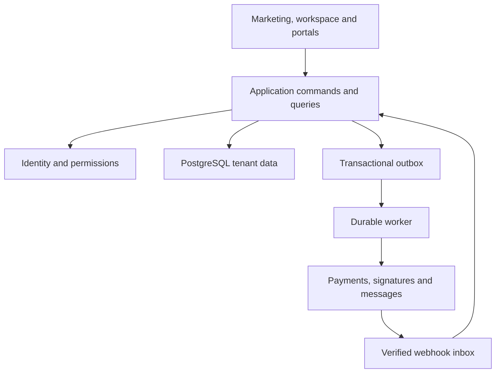

# VenueLoom platform blueprint

Status: foundation design · 23 September 2026.

## Product and system boundary

VenueLoom serves independent venue businesses from sales inquiry through event delivery and reporting. A business can operate several venues, each with bookable spaces, staff, vendors, and local calendars. The same client can book several venues. The owner buys the VenueLoom subscription; an event client pays the venue business. These are separate commercial relationships.

The initial product is a single deployable web application with well-defined modules. It includes the marketing website, authenticated operations workspace, and eventually narrowly scoped client/vendor portals. Separate services are justified only by measured workload or an independent operational requirement. Module interfaces make extraction possible later without building distributed transactions now.

## Technology and deployment decisions

| Concern | Foundation | Reason |
| --- | --- | --- |
| Web | Next.js App Router, React, TypeScript | Marketing and authenticated application in one conventional codebase |
| Hosting target | Netlify | PR previews and conventional Next.js deployment |
| Database | PostgreSQL, hosted on Neon | Relational constraints, transactions, RLS and branching |
| Data access | Typed SQL repositories with explicit SQL migrations; Drizzle may be introduced for query ergonomics | SQL constraints and migrations remain reviewable; no ORM owns domain rules |
| Authentication | Netlify Identity adapter using `@netlify/identity` | Provider identity maps to internal users; authorization stays in VenueLoom |
| Styling | Shared brand tokens, Tailwind and accessible React primitives | Consistent marketing and product appearance |
| Jobs | Database outbox/inbox and a scheduled worker adapter | Durable delivery and retries; never depend on request background promises |
| Files | Private object-storage adapter, metadata in PostgreSQL | Provider may change without changing document ownership |
| Payments | Provider adapter; separate SaaS billing and venue payment modules | Prevents confusing VenueLoom revenue with customer event funds |
| Observability | Structured logs, request IDs, error monitoring, audit trail | Traceable workflows without logging secrets or full client documents |

Production provider resources have not been provisioned by this design. Netlify Identity must be enabled and configured; Neon needs separate migration/runtime credentials. Preview credentials and databases must never point to production by default.

## Monorepo and dependency boundaries

- `apps/web`: routes, server composition, UI and view models. No direct provider calls inside presentation components.
- `packages/domain`: workflow types, validation, transitions and permissions; no React or infrastructure imports.
- `packages/database`: migrations, tenant transactions, repositories and database integration tests.
- `packages/auth`: verified identity and membership resolution. No role decisions from client-controlled metadata.
- `packages/integrations`: payment, email, signature, calendar and storage adapters as they are implemented.
- `packages/jobs`: inbox/outbox processing and task scheduling when external integrations begin.
- `docs`: architecture, decisions, runbooks and delivery status.

Create packages when they contain real code. Empty modules in the roadmap do not imply a finished implementation. The dependency direction is web/jobs → application services → domain/repository interfaces → infrastructure. Marketing can render without database or authentication connectivity.

## Tenant, identity and access model

**An organization is the tenant.** A venue is a property belonging to an organization, not a tenant identity. Users are global identities and may have memberships in several organizations. Venue staff contacts, CRM contacts and login users are distinct records; adding a contact never grants access.

The server verifies an identity provider token, resolves the internal user by `(provider, subject)`, then resolves an active membership and permitted venues. The selected organization is a selector, not evidence of permission. Every command repeats authorization. API keys and jobs use scoped principals with explicit permissions; there is no implicit superuser header.

All tenant tables carry `organization_id`. References to tenant records use `(organization_id, id)` composite foreign keys. This prevents cross-tenant linking even if a query is wrong. Row-level security is defense in depth. The runtime role is neither a table owner nor `BYPASSRLS`; `FORCE ROW LEVEL SECURITY` is applied to tenant tables. A verified membership establishes transaction-local context on the **same database connection** used for queries. Pooled sessions must not retain context between requests.

Organization isolation alone does not implement venue permissions or portal access. Repository queries constrain venue/event access, and command permissions control financial, payroll, settings and invitation actions. Initial admin-only operation is acceptable; pretending a restricted role is secure before its query filters exist is not.

## Domain boundaries

| Module | Owns | Collaborates with |
| --- | --- | --- |
| Organization and access | Organizations, identities, memberships, invitations, permissions, entitlements | Every module |
| Venue configuration | Venues, spaces, capacities, local timezone, opening hours, blackouts | Bookings, staffing, reports |
| CRM and sales | Clients, contacts, inquiries, pipeline, tours, activity, proposal versions | Bookings, documents |
| Bookings and event operations | Events, reservation holds, allocations, run of show, tasks, checklists | CRM, staff, vendors, finance |
| Commercial documents | Proposals, immutable versions, contracts, signatures, file ownership | CRM, bookings, finance |
| Venue finance | Invoices, schedules, receipts, allocations, refunds, credits, reconciliation | Events, payment provider, reports |
| People and partners | Staff profiles, availability, shifts, assignments, vendors, deliverables | Events, restricted payroll |
| SaaS billing | VenueLoom plans, subscriptions, entitlements, platform billing references | Organization and access |
| Integrations and automation | Connections, external IDs, webhook inbox, outbox, scheduled workflows | All modules via explicit events |
| Reporting | Permission-aware projections and metric definitions | Transactional modules as source of truth |

No central arbitrary JSON record table is the authoritative model. JSON is appropriate for provider payloads, versioned document snapshots, event metadata and validated extension fields; core relationships, statuses, money and dates are typed columns.

## Booking correctness

A sales inquiry and a confirmed event are different aggregates. Converting an inquiry creates or selects a client, creates the event and allocation, links the inquiry, and records an audit/outbox event in one transaction. Retries return the same result.

Space reservations use half-open intervals `[start, end)` including setup and teardown buffers. A full-venue reservation conflicts with every space; a room reservation conflicts with itself and full-venue reservations. All writers take a transaction-scoped advisory lock for the venue before checking and writing allocations. Exact-space exclusion constraints provide another guard where available. Concurrent requests must not both confirm overlapping reservations. Initial UI warnings do not substitute for the server rule.

Holds have an explicit expiration and state. Expired holds are released by a worker and rechecked under the venue lock during booking. Time-dependent partial constraints are avoided. Cancelling an event releases its reservation in the same transaction. Archiving a record alone never releases a live booking or erases financial obligations.

Times use `timestamptz` for instants, plus the IANA event timezone and original local inputs where useful for auditing. Calendar queries use the venue timezone, not the viewer's device timezone. Reject nonexistent and ambiguous DST local times unless the offset is explicitly resolved. Changing a venue timezone does not reinterpret previously scheduled instants. Date-only due dates use `date`.

## Financial and document integrity

Amounts are integer minor units with a currency code, never floating point dollars. Quantities and rates requiring fractions use decimal arithmetic; totals preserve the agreed rounding and tax snapshot. A document and its allocations use one currency; currency conversion is a separate recorded operation.

A draft may be edited. An issued invoice, accepted proposal, executed contract or settled payment has immutable financial/legal content. Corrections create revisions, voids, credit notes or refunds with references to the original. Manual payment entry records an externally received payment; it does not charge a card. A contract marked signed is not an electronic signature workflow. External signing requires signer evidence, provider envelope IDs, completion verification and immutable files.

Payment collection integration is deliberately undecided at the charge-pattern level. Before implementation, confirm which business owns the merchant account, who pays fees, who handles disputes/losses and whether VenueLoom receives an application fee. The schema already separates connected accounts, payment attempts, settled receipts, allocations and platform subscriptions so these choices do not change tenant ownership.

Reports distinguish booking value, invoiced amount, collected cash, refunds, outstanding receivables and platform subscription revenue. A booking estimate is not recognized revenue.

## Reliability and extension strategy

Commands validate input and authorization, check the entity version, then write business data, audit and outbox in one transaction. Idempotency keys are scoped to tenant and operation and include a request hash; reusing a key with different content returns a conflict. Readers use cursor pagination as volume grows; a bulk bootstrap endpoint is an initial bounded view, not a permanent unbounded export API.

External side effects occur after commit via outbox workers. Workers lease rows, retry with backoff, deduplicate by stable keys and move exhausted jobs to a visible dead-letter state. Delivery is at least once; handlers must be idempotent. Incoming webhooks verify the raw-body signature, environment and connected account before persisting an inbox row. Acknowledge only after durable acceptance; order-independent reconciliation handles delayed or reordered events.

Integrations store encrypted secrets or secret-manager references, never secrets in browser code or logs. External identifiers are unique by organization/provider/provider-account/environment/object-type. Attachments stay private with expiring authorized download URLs, upload limits and a malware/quarantine state before distribution. Email/calendar sync needs per-account consent and revocation.

## Privacy, operations and evolution

Minimize client PII, redact logs, isolate payroll, and audit sensitive exports and administrative changes. Archive business records; use a separately authorized retention/deletion workflow for erasure while preserving required financial references. Backups, retention requirements and recovery targets require an operational policy before paid launch.

Migrations use a privileged migration role over a direct connection. Runtime uses a restricted pooled connection. Never run migrations from a web request or automatically against production during a normal build. Use expand → backfill → switch reads/writes → contract for breaking changes. Each migration has a tested upgrade path and restore/forward-fix runbook. Test restores, not just backup configuration.

Feature branches use schema-only or sanitized Neon branches. PR previews use their own identity configuration and integrations in test mode. Separate development, staging and production environments. Production migrations and releases are observable, reviewed operations.

## References

- [Next.js on Netlify](https://docs.netlify.com/build/frameworks/framework-setup-guides/nextjs/overview/)
- [PostgreSQL row security](https://www.postgresql.org/docs/current/ddl-rowsecurity.html)
- [PostgreSQL constraints](https://www.postgresql.org/docs/current/ddl-constraints.html)
- [PostgreSQL range types](https://www.postgresql.org/docs/current/rangetypes.html)
- [Neon serverless driver](https://neon.com/docs/serverless/serverless-driver)

See [data model](data-model.md), [workflow and API contracts](workflows.md), [security model](security.md), and [delivery plan](delivery-plan.md) for implementation-level details.
