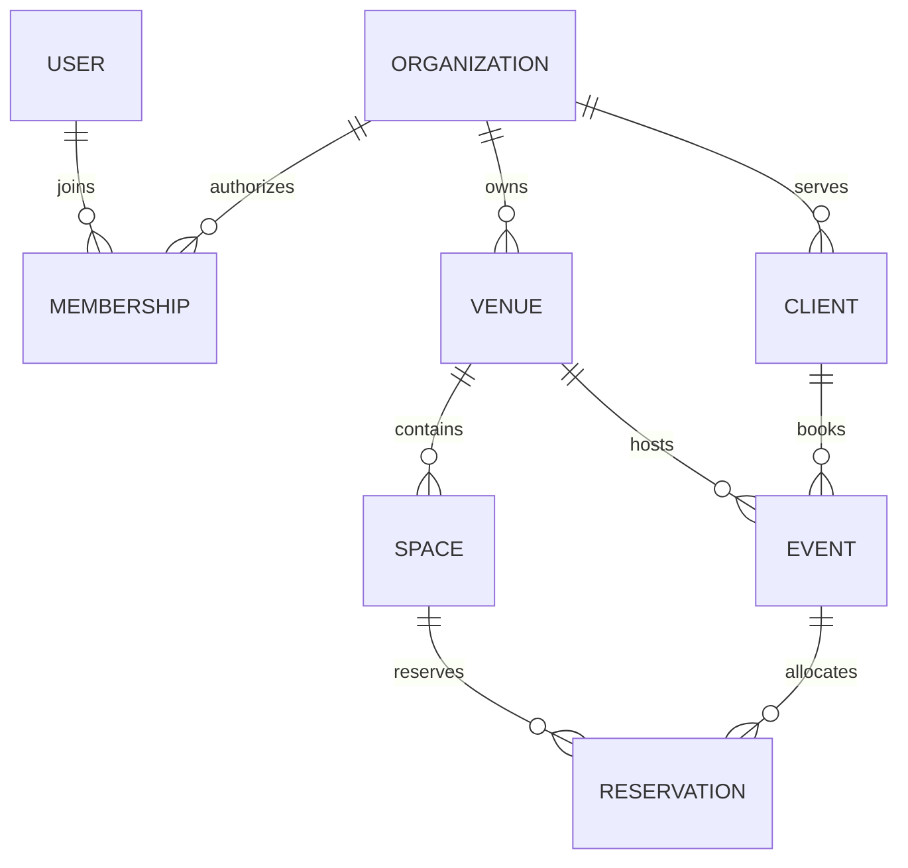
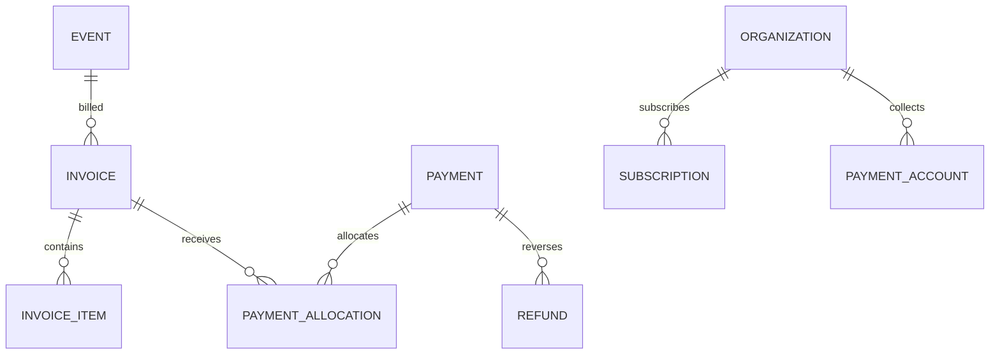

# Data model and invariants

This is the platform target model. The first migration implements only the operational foundation; planned tables are introduced when their owning workflow is implemented. Avoid building unused empty infrastructure merely to mirror this catalog.

## Conventions

- UUID primary keys; organization-scoped records also have `UNIQUE (organization_id, id)`.
- All tenant foreign keys include `organization_id`; venue-specific links include the correct venue where required. Index referencing columns and common `(organization_id, venue_id, status, date)` access paths.
- Mutable aggregates have `version`, UTC `created_at`/`updated_at`, and optional `archived_at`. Writes use expected version. Audit rows are append only to runtime roles.
- Stable machine status codes are translated for display. Check constraints protect valid values. Workflow services protect legal transitions.
- `bigint` minor-unit money values have checked nonnegative ranges where appropriate; serialize large values safely. Initial USD UI stays within JavaScript's safe integer range. Currency is explicit in storage even before multi-currency UI.
- `date` is a calendar day. `timestamptz` is an instant. `timezone` is an IANA identifier validated by the application.
- JSON columns must have a documented schema version. They cannot replace foreign keys or money/status columns.

## Identity and configuration

| Table | Important columns / relationships | Invariant |
| --- | --- | --- |
| organizations | id, name, slug, status, default_currency | Business data owner; slug unique |
| users | id, display_name, email, disabled_at | Internal ID survives identity provider changes; email alone is not identity |
| user_identities | user_id, provider, subject | Unique provider + subject; verified by server |
| memberships | organization_id, user_id, role, status | Unique organization/user; last active owner cannot be removed |
| invitations | organization_id, email, role, token_hash, expires_at, accepted_at | Single-use token, expiry, inviter permission |
| membership_venue_grants | membership_id, venue_id | Both in same organization; empty set does not silently mean all venues |
| roles / role_permissions | role code, permission code | Built-in roles first; custom roles additive |
| venues | organization_id, name, timezone, currency, capacity, address | Currency changes cannot reinterpret existing money |
| spaces | organization_id, venue_id, name, capacity, active | Stable space ID; renaming does not affect past bookings |
| venue_blackouts | venue_id, start_at, end_at, reason | Uses same reservation lock/conflict logic |
| business_hours | venue_id, weekday, local_open, local_close, effective dates | Advisory scheduling defaults; DST conversion explicit |

## CRM, sales and bookings

| Table | Important columns / relationships | Invariant |
| --- | --- | --- |
| clients | organization_id, name, organization_name, primary_contact fields | A person/company customer; staff/vendor identity is separate |
| contacts / client_contacts | person details; client/contact relationship + role | Allows multiple planners, payers and decision makers |
| inquiries | venue_id, client_id?, name, contact details, proposed_date, guests, estimated_minor, currency, source, status, booked_event_id? | Booked event link is created by conversion command only |
| inquiry_activities | inquiry_id, actor_id, type, occurred_at, summary | Append-only timeline; visibility explicit |
| tours | inquiry_id, venue_id, starts_at, ends_at, host_membership_id | May coexist with event if operational policy permits |
| events | venue_id, client_id?, name, event_type, starts_at, ends_at, timezone, guests, booking_minor, currency, status | End after start; cancelled has no active reservation |
| event_contacts | event_id, contact_id, relationship, portal scope | Separate from organization membership |
| reservations | event_id?, venue_id, space_id? (null = full venue), start_at, end_at, state, hold_expires_at? | Active overlap blocked under venue lock; range includes buffers |
| event_timeline_items | event_id, start_at, end_at?, owner, title, sequence | Run of show ordered independently from task completion |
| task_templates / template_items | organization_id, version, relative deadline, role | Instantiated tasks preserve template version |
| tasks | venue_id, event_id?, assigned_staff_id?, title, due_date, priority, status | Completing a task records actor/time |
| checklists / checklist_items | event_id, template_version, status | Event-specific snapshot |
| notes | explicit parent key, visibility, body, actor | No arbitrary unvalidated polymorphic target IDs |

## Proposals, contracts and files

| Table | Important columns / relationships | Invariant |
| --- | --- | --- |
| catalog_items / price_versions | item, unit, decimal price, currency, effective period | Past quotes retain their price snapshot |
| proposals / proposal_versions | inquiry/event, version, totals, valid_until, state | Sent/accepted version immutable |
| proposal_items | proposal_version_id, quantity, rate, tax snapshot, line total | Exact decimal rounding policy |
| proposal_acceptances | proposal_version_id, actor evidence, accepted_at | Accepts one exact version, not a mutable document |
| contract_templates / template_versions | text, version, active | Edits create a new template version |
| contracts / contract_versions | event_id, name, status, terms, document_hash, version | Executed content immutable; tracked agreement separated from e-sign evidence |
| signature_envelopes / signers | provider, external_id, version, signer order, verification evidence | Provider completion verified before executed status |
| files / file_versions | storage_key, tenant, media_type, bytes, sha256, scan_state | Private default; immutable stored version |
| event_files / contract_files | typed links, visibility | Tenant checked by composite FK; no public raw bucket URLs |

## Venue money versus VenueLoom money

| Table | Important columns / relationships | Invariant |
| --- | --- | --- |
| invoices / invoice_items | event, client, document_number, issued/due dates, currency, totals, immutable item snapshot | Unique invoice number per organization; no edits after issue |
| payment_schedules / installments | event/invoice, due date, amount | Schedule is an expectation, not received cash |
| payment_attempts | provider request, amount, currency, idempotency key, state | Failed attempt is not a settled receipt |
| payments | event_id, amount_minor, currency, received_date, method, provider_ref?, status | Initial implementation records external/manual receipts; settled content locked |
| payment_allocations | payment_id, invoice_id, allocated_minor | Allocation cannot exceed available receipt/invoice balance; lock affected rows in stable order |
| refunds / credit_notes | original payment/invoice, amount, reason, provider_ref, state | Additive reversal; does not erase original transaction |
| financial_entries / entry_lines | posting type, amount, currency, account, reference | Balanced immutable journals when accounting integration is introduced |
| reconciliation_runs / matches | account, provider statement, local transaction, difference | Duplicate external transactions rejected; review unresolved matches |
| payment_accounts | organization, provider, external account, environment, capability status | Venue merchant relationship; separate from platform subscription |
| billing_customers / subscriptions | organization, provider IDs, plan/version, status, period | Bills the organization for VenueLoom |
| plans / entitlements / usage | versioned limit definitions, grants, meters | Server checks entitlement; client UI is not enforcement |

## Staff, vendors and integrations

| Tables | Structure and invariants |
| --- | --- |
| staff_profiles, staff_user_links | Organization-scoped contacts; explicit optional verified user link; no access granted by creating staff |
| availability, shifts, assignments | Event/venue/staff links, instants, status; staff conflicts checked under person lock; no private rates in general staff views |
| pay_rates, time_entries, payroll_batches/lines | Effective dated rates, approved time, immutable export snapshots; payroll is a future restricted module |
| vendors, event_vendors, deliverables | Organization partner directory and event-specific scope/cost/agreement |
| resources, inventory_units, allocations | Quantity and unique-resource reservation models; venue/space booking not repurposed for inventory counts |
| portal_grants | Specific event/contact, permission scope, expiry/revocation; no implicit organization-wide read |
| integration_connections, external_mappings | Account/environment-aware references; secrets encrypted or stored by reference |
| webhook_inbox | Unique provider/account/environment/event_id, raw-body hash, verification metadata, processing status |
| outbox, job_runs | Event type + schema version, tenant, aggregate, retry schedule, lease expiry, idempotency key |
| notifications, preferences | Recipient/scope/channel/template/version/delivery status; consent and unsubscribe where applicable |
| audit_events | Organization, actor, action, entity, correlation ID, timestamp, redacted changes; append only |
| idempotency_requests | Organization, operation, key, request_hash, response, expiry | Unique scope; same key/different body rejected |

## Indexing, deletion and evolution

Use partial indexes for active inquiries/tasks and upcoming events; B-tree indexes for tenant/date/status and linked entities. Add range indexes for availability and full-text search only after query measurements. Reports use consistent definitions and eventually projections/materialized views; they never bypass permissions.

Use RESTRICT for financial and signed-document references. Archive routine operational records. Erasure is an explicit policy-driven job that redacts permitted PII while retaining required identifiers. No blanket cascading organization deletion from ordinary application credentials.

Migrations are numbered and checksummed. An additive table/column is normal evolution. A change to data ownership, currency semantics, identity keys or immutable history requires an ADR and a data migration plan.
